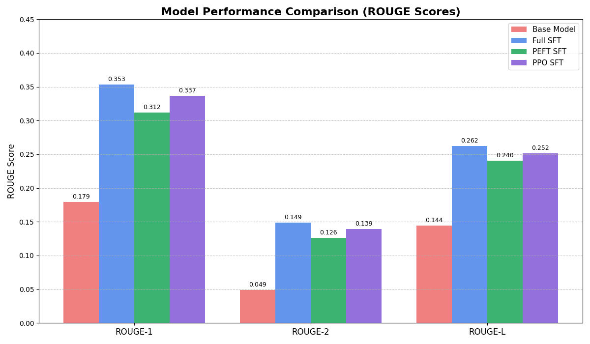
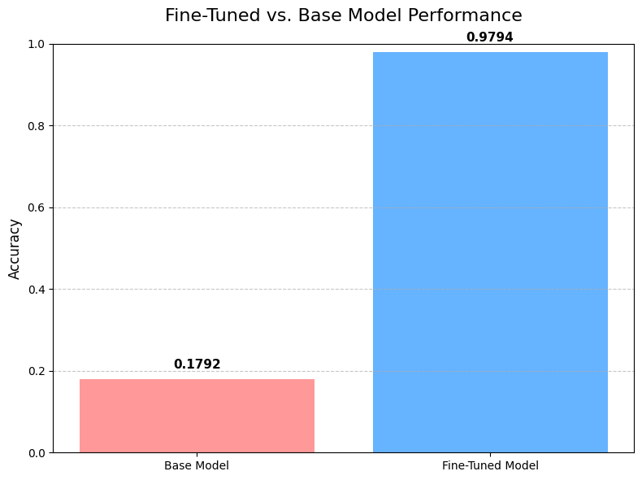

# Aligning a Language Model with Human Feedback (RLHF)

An end-to-end implementation of Reinforcement Learning from Human Feedback (RLHF) to align a GPT-2 model with human preferences, demonstrating the full Supervised Fine-Tuning (SFT), Reward Modeling, and Proximal Policy Optimization (PPO) pipeline.

---

### Table of Contents
- [Project Overview](#project-overview)
- [The RLHF Methodology](#the-rlhf-methodology)
- [Key Results & Performance](#key-results--performance)
- [Getting Started](#getting-started)
- [Project Structure](#project-structure)
- [Technologies & Libraries](#technologies--libraries)

---

### Project Overview

Large Language Models (LLMs) are incredibly powerful, but ensuring their outputs are helpful, harmless, and aligned with human values is a critical challenge. This project implements the complete Reinforcement Learning from Human Feedback (RLHF) pipeline, a state-of-the-art technique used to align models like ChatGPT and Claude.

Starting with a base `gpt2` model, this project demonstrates the three core stages:
1.  **Supervised Fine-Tuning (SFT):** Teaching the model the desired response style and format on a high-quality instruction dataset.
2.  **Reward Modeling (RM):** Training a separate model to act as a "preference judge," learning to score which of two responses is better.
3.  **Reinforcement Learning (PPO):** Using the reward model as a signal to further tune the SFT model, optimizing its policy to generate responses that maximize the learned human preferences.

This repository serves as a comprehensive, hands-on guide to understanding and implementing the complex but powerful process of LLM alignment.

---

### The RLHF Methodology

The entire process is a sequential pipeline where the output of one stage becomes the input for the next. This ensures a systematic progression from a general-purpose base model to a specialized, aligned model.


**Stage 1: Supervised Fine-Tuning (SFT)**
- **Goal:** Adapt the base model to the domain and style of the instruction-following dataset.
- **Process:** We perform both full fine-tuning and parameter-efficient fine-tuning (PEFT) using QLoRA to compare performance and efficiency. This teaches the model the fundamental structure of a helpful response.

**Stage 2: Reward Modeling (RM)**
- **Goal:** Train a model that can predict which response a human would prefer.
- **Process:** We use a dataset of `(prompt, chosen_response, rejected_response)` tuples to train a regression model. This model learns to assign a scalar "reward" score that quantifies the quality of a given response. Our fine-tuned Reward Model achieved **97.9% accuracy** in predicting the preferred response.
  
**Stage 3: Proximal Policy Optimization (PPO)**
- **Goal:** Use the Reward Model as a guide to optimize the SFT model's policy.
- **Process:** We treat the SFT model as an agent in a reinforcement learning environment. For a given prompt, the agent generates a response. This response is then scored by the frozen Reward Model. The PPO algorithm uses this reward score to update the SFT model's weights, encouraging it to generate more high-reward responses in the future. A KL-divergence penalty is used to prevent the model from deviating too far from the original SFT policy.

---

### Key Results & Performance

The alignment process yielded significant improvements at each stage, validated through both standard metrics (ROUGE) and our learned reward model.

#### Model Performance Comparison (ROUGE Scores)
The PPO-aligned model shows substantial gains over the base model and maintains the high performance achieved during the SFT phase, demonstrating its ability to learn preferences without sacrificing coherence.



#### Reward Model Performance
Our trained Reward Model is highly effective at distinguishing between high and low-quality responses, forming a reliable foundation for the PPO stage.



#### Final Alignment Success (Average Reward Score)
The ultimate measure of success is the average score our final models receive from the Reward Model. The PPO-aligned model clearly outperforms both the SFT and base models, confirming that the RLHF process successfully optimized for our learned preferences.

| Model                 | Average Reward Score |
| :-------------------- | :------------------- |
| **PPO Aligned Model** | **2.375** |
| SFT Model             | 1.545                |
| Base Model            | -0.455               |

---

### Getting Started

#### Prerequisites
- Python 3.8+
- PyTorch & CUDA
- A Hugging Face account and access token

#### 1. Clone the Repository
```bash
git clone [https://github.com/your-username/LLM-Alignment-RLHF.git](https://github.com/your-username/LLM-Alignment-RLHF.git)
cd LLM-Alignment-RLHF
```

## 2. Set Up the Environment
It is recommended to use a virtual environment.

### Bash
```bash
python -m venv venv
source venv/bin/activate  # On Windows, use `venv\Scripts\activate`
pip install -r requirements.txt
```

## 3. Using the Pre-Trained Models

For convenience, all final models are available on the **Hugging Face Hub**.  
You do not need to retrain them to see the results.

- **Final SFT Model (Full)**
- **Final Reward Model**
- **Final PPO Aligned Model**

The notebooks are configured to use these models for evaluation.

---

## 4. Running the Pipeline

The project is organized into three sequential stages.  
The notebooks within each folder should be run in order:

- **`01_supervised_finetuning/`**: Contains notebooks for data prep and SFT experiments.  
- **`02_reward_modeling/`**: Contains notebooks for preparing reward data and training the RM.  
- **`03_ppo_alignment/`**: Contains the notebook for the final PPO training loop.  

---

## Project Structure

The repository is organized to clearly separate the code for each stage of the RLHF pipeline from the generated outputs.

```bash
LLM-Alignment-RLHF/
├── 01_supervised_finetuning/   # Scripts and notebooks for SFT
├── 02_reward_modeling/         # Scripts and notebooks for Reward Modeling
├── 03_ppo_alignment/           # Scripts and notebooks for PPO
├── outputs/
│   ├── checkpoints/            # (Ignored by git) Where trained models are saved locally
│   ├── evaluation/             # CSV and JSON files with performance metrics
│   └── plots/                  # Generated plots and visualizations
├── requirements.txt
├── .gitignore                  # Specifies files to ignore (e.g., model checkpoints)
└── README.md                   # You are here!
```


---

## Technologies & Libraries

- **Core ML/RL**: PyTorch, PEFT (Parameter-Efficient Fine-Tuning), TRL (Transformer Reinforcement Learning)  
- **Hugging Face**: `transformers`, `datasets`, `accelerate`, `bitsandbytes`  
- **Data Handling**: Pandas, NumPy  
- **Visualization**: Matplotlib  
