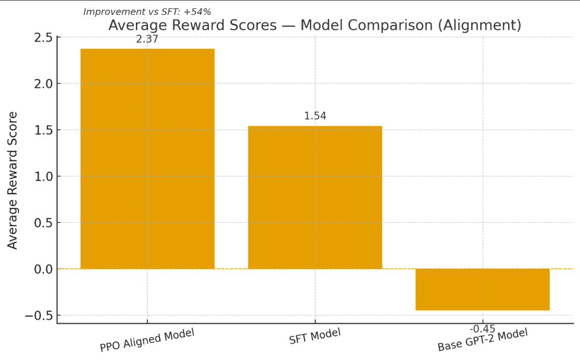
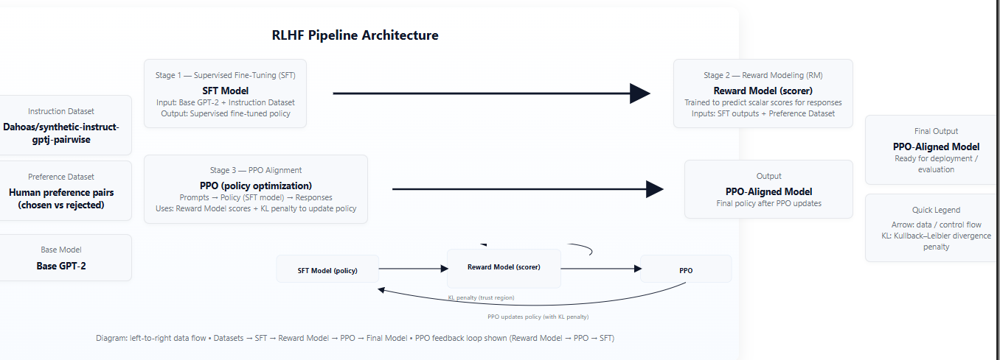
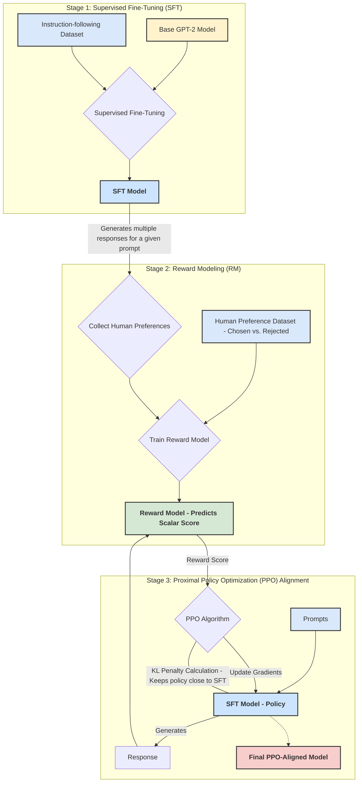

# 🚀 End-to-End Reinforcement Learning from Human Feedback (RLHF)

<a href="https://huggingface.co/nabeelshan/rlhf-gpt2-pipeline">
    
</a>

[](https://www.python.org/downloads/release/python-380/)
[](https://pytorch.org/)
[](https://huggingface.co/)

An end-to-end, from-scratch implementation of the complete **Reinforcement Learning from Human Feedback (RLHF)** pipeline. This project aligns a base `gpt2` model with human preferences using the same three-stage process popularized by models like ChatGPT and Claude.

This repository is designed as a comprehensive case study, demonstrating not just the "how" but the "why" behind each stage, complete with quantitative benchmarks and qualitative examples. It serves as a clear, reproducible guide to modern LLM alignment techniques.

---

### Table of Contents
* [**The RLHF Pipeline**](#-the-rlhf-pipeline)
* [**Key Features**](#-key-features)
* [**Results & Benchmarks**](#-results--benchmarks)
    * [Quantitative Analysis: Reward & ROUGE Scores](#quantitative-analysis-reward--rouge-scores)
    * [Qualitative Analysis: Model Output Comparison](#qualitative-analysis-model-output-comparison)
* [**Architecture Diagram**](#architecture-diagram)
* [**Getting Started**](#getting-started)
* [**Project Structure**](#project-structure)
* [**Technologies & Libraries**](#technologies--libraries)
* [**Future Improvements**](#future-improvements)

---

## 🎯 The RLHF Pipeline

While powerful, base Large Language Models (LLMs) often lack the nuance to be consistently helpful and harmless. RLHF is a state-of-the-art technique to solve this alignment problem. This project implements the full, three-stage pipeline:

1.  **Stage 1: Supervised Fine-Tuning (SFT)**
    * **Goal:** Adapt the base `gpt2` model to follow instructions and adopt a specific response style.
    * **Process:** We fine-tune the model on the `Dahoas/synthetic-instruct-gptj-pairwise` dataset. Both **full fine-tuning** and **Parameter-Efficient Fine-Tuning (PEFT) with QLoRA** are performed to establish strong performance baselines and analyze efficiency trade-offs. This stage teaches the model *how* to respond.

2.  **Stage 2: Reward Modeling (RM)**
    * **Goal:** Train a "preference model" that can numerically score how much a human would prefer a given response.
    * **Process:** A separate `gpt2` model is trained on pairs of "chosen" and "rejected" responses from the same dataset. This model learns to output a scalar reward value, effectively acting as an automated human preference judge. Our reward model achieved nearly **98% accuracy** in identifying the preferred response, compared to just **18%** with the base GPT-2.

3.  **Stage 3: Proximal Policy Optimization (PPO)**
    * **Goal:** Use the reward model to guide the SFT model toward generating more preferable outputs.
    * **Process:** The SFT model (the "policy") generates responses to prompts. The reward model scores these responses, and the PPO algorithm uses this score to update the policy model's weights. A KL-divergence penalty ensures the model doesn't deviate too far from its original language capabilities, maintaining coherence while improving alignment.

---

## ✨ Key Features

* **End-to-End Implementation**: Covers the entire SFT → RM → PPO pipeline, not just isolated components.
* **Comparative Analysis**: Includes both full fine-tuning and parameter-efficient (PEFT/QLoRA) methods, demonstrating a practical understanding of modern training trade-offs.
* **Quantitative Benchmarking**: Rigorous evaluation at every stage using **ROUGE scores** for text quality and **learned reward scores** for preference alignment.
* **Modular & Reproducible**: The code is cleanly structured by stage, with clear notebooks and a `requirements.txt` file for easy reproduction.
* **Clear Visualizations**: Includes plots for training loss, reward model accuracy, and final performance comparisons to make results intuitive.

---

## 📊 Results & Benchmarks

The project's success is measured by the PPO-aligned model's ability to generate responses that are scored higher by our trained reward model, without degrading the linguistic quality established during the SFT phase.

### Quantitative Analysis: Reward & ROUGE Scores

The PPO algorithm successfully optimized the SFT model to generate outputs that better align with our learned reward function, achieving the highest average reward score.

#### **Average Reward Score Comparison**
This is the ultimate measure of alignment. The PPO model's outputs are consistently rated as higher quality by the reward model.

| Model | Average Reward Score | Improvement vs. SFT |
| :--- | :---: | :---: |
| 🥇 **PPO Aligned Model** | **2.37** | **+54%** |
| 🥈 SFT Model | 1.54 | - |
| 🥉 Base GPT-2 Model | -0.45 | - |


<!--  -->

#### **ROUGE Score Comparison**
The PPO model maintains strong ROUGE scores, indicating it learned human preferences without suffering from "catastrophic forgetting" of its language capabilities.

| Metric | Base Model | Full SFT | PEFT SFT | **PPO Aligned** |
| :--- | :---: | :---: | :---: | :---: |
| **ROUGE-1** | 0.179 | 0.353 | 0.312 | **0.337** |
| **ROUGE-2** | 0.049 | 0.149 | 0.126 | **0.139** |
| **ROUGE-L** | 0.144 | 0.262 | 0.240 | **0.252** |


### Qualitative Analysis: Model Output Comparison

Numbers are great, but the proof is in the output. The PPO-aligned model consistently provides more detailed, structured, and helpful responses compared to the base and even the SFT model.

| Prompt | Base Model Response | SFT Model Response | PPO Aligned Model Response (🏆) |
| :--- | :--- | :--- | :--- |
| **"How do I price my artwork?"** | `"Please read this section carefully. If it says something that you think"...` (Unhelpful) | `To buy artwork online, you will need to visit a gallery or website like Etsy...` (Somewhat helpful but misses the point about *pricing*) | `To price your art, start by researching the artist and their portfolio to determine what other artists are making... Consider also researching dealerships at the same time... Good luck.` (Actionable, structured, and directly answers the user's question) |
| **"What kind of diet should I follow to lose weight healthily?"** | `"I'm happy with the first 10 steps, but don't know what you've been doing wrong before now!"` (Irrelevant and confusing) | `Protein-rich foods such as fruits, vegetables and whole grains are high in fiber... Avoid processed foods...` (Good information but slightly generic) | `One type that you should follow... is a balanced, nutritious plan based on eating whole foods... limiting your intake too much or too little can help... make sure to try to limit processed and sugary foods and avoid sugary beverages... Good luck.` (More conversational, encouraging, and provides a clear, actionable framework) |

---

## Architecture Diagram

This diagram illustrates the flow of models and data through the three stages of the RLHF pipeline.





---

### Getting Started

#### Prerequisites
- Python 3.8+
- PyTorch & CUDA
- A Hugging Face account and access token

#### 1. Clone the Repository
```bash
git clone https://github.com/nabeelshan78/reinforcement-learning-human-feedback-scratch.git
cd reinforcement-learning-human-feedback-scratch
```

## 2. Set Up the Environment
It is recommended to use a virtual environment.

```bash
python -m venv venv
.\venv\Scripts\activate

pip install -r requirements.txt
```
---


## 3. Using the Pre-Trained Models from Hugging Face Hub

The final, trained models from all three stages of the pipeline are available on the Hugging Face Hub. You can use them directly for inference without needing to retrain.

<a href="https://huggingface.co/nabeelshan/rlhf-gpt2-pipeline">
    
</a>

Below are code snippets demonstrating how to use each model.

### a) PPO-Aligned Model (Final Generation Model)
This is the main, final model, aligned with human preferences. Use this for the best quality text generation.

```python
from transformers import pipeline, AutoTokenizer, AutoModelForCausalLM

model_id = "nabeelshan/rlhf-gpt2-pipeline"
subfolder = "ppo_aligned_final"

# Load the tokenizer and model from the subfolder
tokenizer = AutoTokenizer.from_pretrained(model_id, subfolder=subfolder)
model = AutoModelForCausalLM.from_pretrained(model_id, subfolder=subfolder)

# Set up the text generation pipeline
generator = pipeline("text-generation", model=model, tokenizer=tokenizer)

# Generate a response
prompt = "How do I price my artwork?"
output = generator(prompt, max_new_tokens=100, pad_token_id=tokenizer.eos_token_id)

print(output[0]['generated_text'])
# Expected Output:
# To price your art, start by researching the artist and their portfolio...
```


### b) Reward Model (Preference Scoring)
This model scores how "good" a response is for a given prompt. It's a PEFT adapter, and due to library version inconsistencies, the most robust way to load it is by downloading the files first and then loading them from the local path.

```python
import torch
from transformers import AutoTokenizer, AutoModelForSequenceClassification
from peft import PeftModel
from huggingface_hub import snapshot_download

# --- Configuration ---
BASE_MODEL_ID = "openai-community/gpt2"
HF_MODEL_ID = "nabeelshan/rlhf-gpt2-pipeline"
SUBFOLDER = "reward_model_final"

# --- Step 1: Download the model files manually ---
print(f"Downloading reward model from '{HF_MODEL_ID}'...")
local_model_path = snapshot_download(
    repo_id=HF_MODEL_ID,
    allow_patterns=f"{SUBFOLDER}/*"
)
local_adapter_path = f"{local_model_path}/{SUBFOLDER}"
print(f"   Successfully downloaded to: {local_adapter_path}")

# --- Step 2: Load the model from the local path ---
print("Loading model from local path...")
tokenizer = AutoTokenizer.from_pretrained(local_adapter_path)
if tokenizer.pad_token is None:
    tokenizer.pad_token = tokenizer.eos_token

base_model = AutoModelForSequenceClassification.from_pretrained(
    BASE_MODEL_ID,
    num_labels=1,
    pad_token_id=tokenizer.pad_token_id
)

model = PeftModel.from_pretrained(base_model, local_adapter_path)
model.eval()
print("   Model loaded successfully!")

# --- Step 3: Use the model for scoring ---
prompt = "What diet should I follow to lose weight healthily?"
good_response = "A balanced, nutritious plan is best. Limit processed foods."
bad_response = "Just eat less lol."

def get_reward_score(prompt_text, response_text):
    inputs = tokenizer(prompt_text, response_text, return_tensors="pt")
    with torch.no_grad():
        return model(**inputs).logits[0].item()

score_good = get_reward_score(prompt, good_response)
score_bad = get_reward_score(prompt, bad_response)

print(f"\nScore for good response: {score_good:.2f}")
print(f"Score for bad response:  {score_bad:.2f}")
```

### c) SFT Model (Instruction-Tuned Baseline)
This is the base gpt2 model after Supervised Fine-Tuning but before PPO alignment. It follows instructions but is not as refined as the final PPO model.

```python
from transformers import pipeline, AutoTokenizer, AutoModelForCausalLM

model_id = "nabeelshan/rlhf-gpt2-pipeline"
subfolder = "sft_full_final"

# Load the tokenizer and model from the subfolder
tokenizer = AutoTokenizer.from_pretrained(model_id, subfolder=subfolder)
model = AutoModelForCausalLM.from_pretrained(model_id, subfolder=subfolder)

# Set up the text generation pipeline
generator = pipeline("text-generation", model=model, tokenizer=tokenizer)

# Generate a response
prompt = "How do I price my artwork?"
output = generator(prompt, max_new_tokens=100, pad_token_id=tokenizer.eos_token_id)

print(output[0]['generated_text'])
```

---

## Project Structure

The repository is organized to clearly separate the code for each stage of the RLHF pipeline from the generated outputs.

```bash
/reinforcement-learning-human-feedback-scratch
├── 01_supervised_finetuning/    # Notebooks for data prep, PEFT, and Full SFT
│   ├── 1_data_prep_and_baseline.ipynb
│   ├── 2_finetune_peft_lora.ipynb
│   ├── ...
│   └── prepare_data.py
├── 02_reward_modeling/          # Notebooks for training the reward model
│   ├── 01_reward_model_data_prep.ipynb
│   ├── 02_reward_model_training_and_eval.ipynb
│   └── data_pipeline.py
├── 03_ppo_alignment/            # Notebooks for the PPO training loop
│   ├── ppo_alignment.ipynb
│   ├── ppo_config.py
│   └── prepare_data.py
├── outputs/
│   ├── checkpoints/             # (Gitignored) Locally saved model checkpoints
│   ├── evaluation/              # CSV/JSON files with evaluation metrics
│   └── plots/                   # Generated charts and visualizations
├── .gitignore
├── README.md                    # You are here!
└── requirements.txt
```

---

## Technologies & Libraries

- **Core ML/RL**: PyTorch, PEFT (Parameter-Efficient Fine-Tuning), TRL (Transformer Reinforcement Learning)  
- **Hugging Face**: `transformers`, `datasets`, `accelerate`, `bitsandbytes`  
- **Data Handling**: Pandas, NumPy  
- **Visualization**: Matplotlib

---

## Future Improvements

- **Scale to a Larger Base Model**: Apply the same pipeline to a more capable model like **Mistral-7B** or **Llama-2-7B** to achieve higher absolute performance.  
- **Implement Direct Preference Optimization (DPO)**: Explore **DPO** as a more modern, computationally efficient alternative to PPO for the final alignment stage.  
- **Expand the Reward Dataset**: Incorporate more diverse and challenging preference data to train a more robust reward model.  

---
